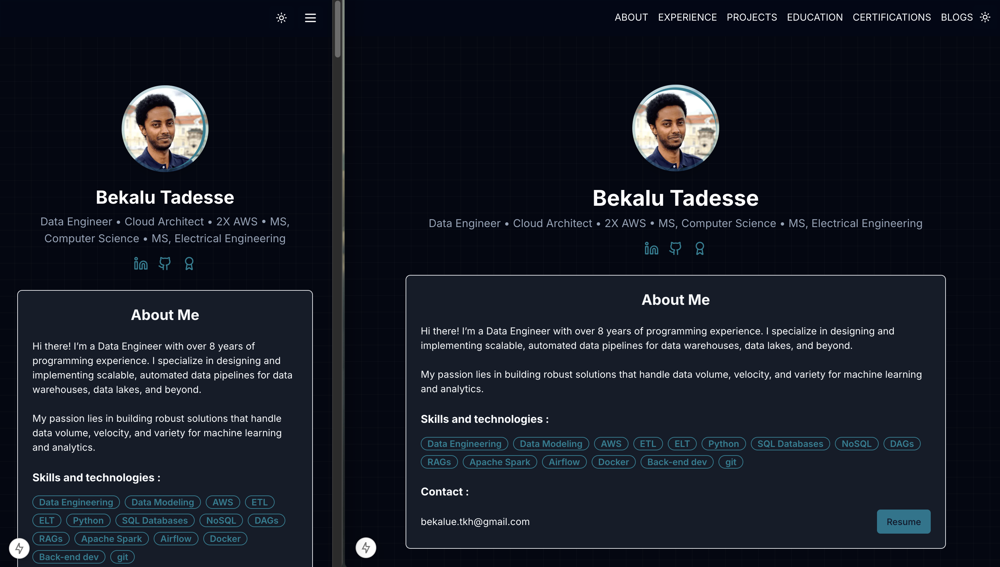
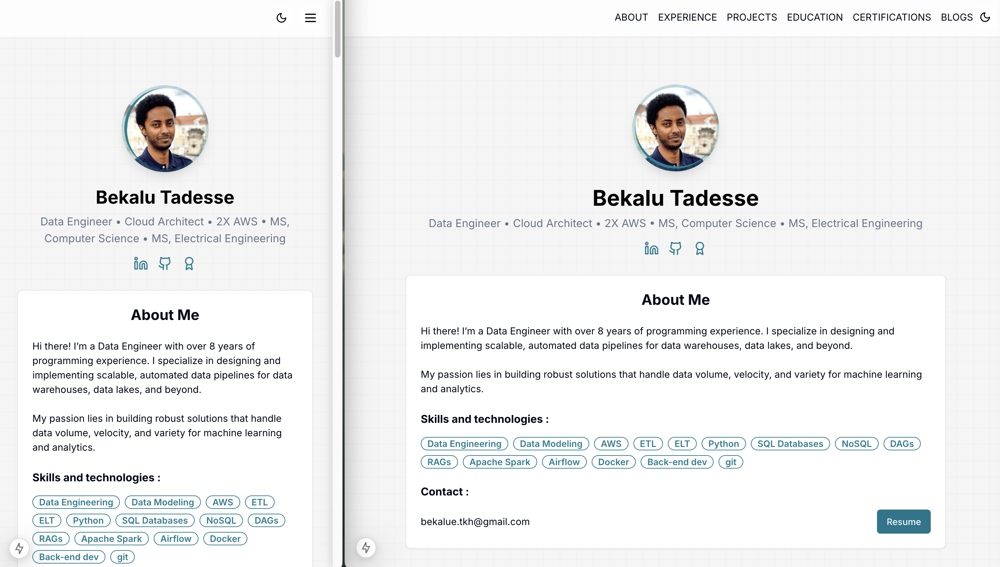
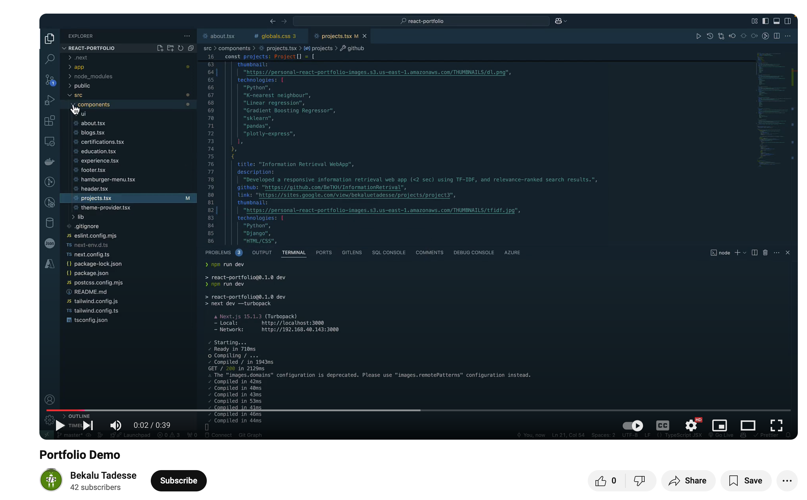

# React Portfolio Project

The actual repo is private and this repo is created to share high level info.

The personal portfolio project is created using React [Vite](https://vitejs.dev/), a fast frontend build tool.

- Thumbnails and images are hosted in AWS S3.

- The website is deployed via Vercel.

- The domain is registered with GoDaddy.

## Screenshots

#### Dark Mode



#### Light Mode



#### Projects Section


## DEMO

[](https://youtu.be/a3HQ_dvjFVI)

## Getting Started

Run the development server:

```bash
npm run dev
```

- Open [http://localhost:5173](http://localhost:5173) in your browser to view the project.
- Once development is complete, build the project and resolve any issues:

  ```bash
  npm run build
  ```

- Finally, push your changes to your Git repository.

## Learn More

React and Vite resources:

- [Vite Documentation](https://vitejs.dev/guide/) - learn about Vite features and configuration.
- [React Documentation](https://react.dev/) - learn about React features and API.
- [The Vite GitHub Repository](https://github.com/vitejs/vite) - contribute and provide feedback.
